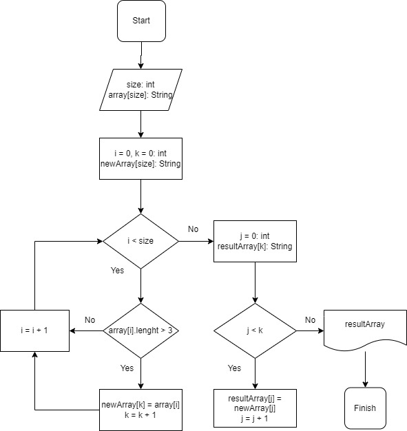

## Преобразователь 1.0

### Описание
Программа принимает массив строк и формирует новый массив в который передаются значения строк длиной меньше 3

### Принцип работы

1. Исходный массив вводится пользователем в консоли. Значения разделяются пробелом.
2. Формируется временный массив длинной как изначальный, в который добавляются строки 3 и менее символов. На этом же этапе идет подсчет нужных элементов массива.
3. Результирующий массив формируется после определения размера массивы, который происходит в п.3. В него последовательно переносятся элементы временного массива.
4. Программа выполнена средствами ООП.

### Блок-схема

